## Chef-O-Mat

Ever found yourself staring at a random assortment of ingredients and a few pantry staples, wondering, "What can I make with these?" Then this website is here to answer that question for you. 
Whether you are a practiced home cook or someone who couldn't boil an egg - this site has your back. Simply input five of your ingredients and any particular cuisine style, and the Chef-O-Mat will give you some simple, delicious, and creative meal recipes.
Turn the last meal time before the week's grocery shop into a fun culinary playground!


## Table of Contents
- [Wire Frame](#wire-frame)
- [Learning Outcomes](#learning-outcomes)
  - [Delivered as part of Project 1](#delivered-as-part-of-project-1)
- [Site Map](#site-map)
- [Features](#features)
  - [Favicon](#favicon)
  - [Header](#header)
  - [Footer](#footer)
  - [Main Page Welcome](#main-page-welcome)
  - [Main Page Staples](#main-page-staples)
  - [Web App page](#web-app-page)
  - [Not There](#not-there)
  - [Thanks](#thanks)
  - [Seasonal](#seasonal)
  - [404](#404-page)
- [Testing](#testing)
  - [General Testing](#general-testing)
  - [Accessibility Testing](#accessibility-testing)
  - [Validation Testing](#validation-testing)
  - [Unfixed Issues](#unfixed-issues)
- [Deployment](#deployment)
  - [Development and source control](#development-and-source-control)
  - [Deployment Process](#deployment-process)
  - [Cloning](#cloning)
- [References](#references)
- [Technologies Used](#technologies-used)
- [Credits and Thanks](#credits-and-thanks)


## Wire Frame

Here is the wirefame which formed the foundation of the website's design. It specifies the desired layout and helped to guide understanding of the CSS styling.


## Learning outcomes 

### (Delivered as part of Project 1)
**LO1: Design an interactive Front-End web application using HTML and CSS based on the principles of user experience design, accessibility and responsivity.**

I designed and built a multi-page, responsive and mobile first website using HTML and CSS. The design is derived from research as well as my own preferences for the UX of a site. Accessibility was considered from the beginning of the project and largely meets ARIA requirements. The site is also fully responsive adapting on the fly to resolutions from 250px to at least 3440px ensuring a consistent user experience.

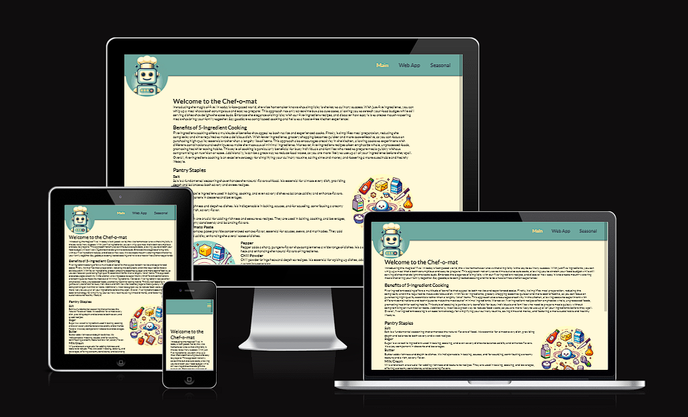

**LO2: Test a front-end web application through the development, implementation and deployment stages.**

Throughout the development process, I have maintained a rigorous design, build, test, iterate cycle ensuring both smooth functionality as well as a pleasing, consistent user experience across a wide array of browsers, operating systems and device types. 

**LO3: Deploy a Front-End web application to a Cloud platform.**

The Chef-O-Mat site has successfully been deployed to the web via GitHub Pages. The deployment not only assures the site is reachable on the general web, but it was also key to being able to test the design and eliminate bugs. The deployed site was continuously updated from the commits on the main project's GitHub repository.

**LO4: Maximise future maintainability through documentation, code structure and organisation.**
**LO4: Maximise future maintainability through documentation, code structure and organisation.**

Maintainability was built in from the initiall project stages with clear naming conventions, modularised CSS and code practices. The Readme document provides detail on the project from setup and installation to current status, testing performed and future development goals.

**LO5: Demonstrate and document the development process through a version control system such as GitHub.**

The entire development of the project has been managed using GitHub as its version control and development environment. Changes have been committed regularly with clear commit messaging allowing a full over view of the progress and milestones of the project's process from concept to submission. 

## Site Map
Here is a visual site map of the Chef-O-Mat site:

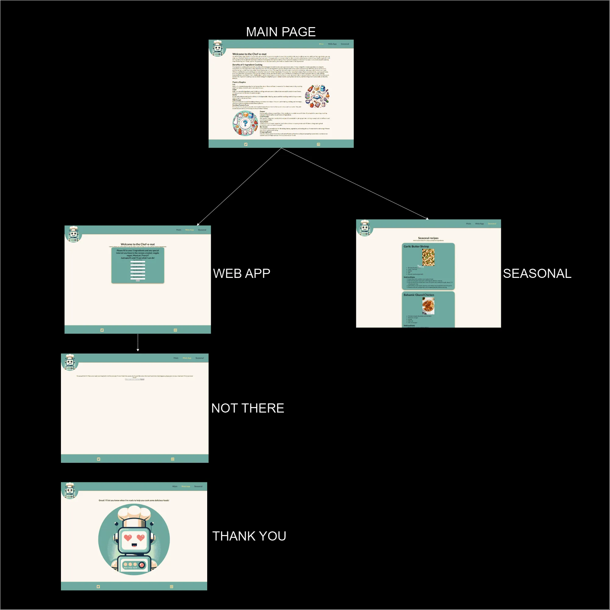

## Features 

The envisioned features of this project aim to transform the basic, static site  into a dynamic and interactive web application. The primary functionality will be an ingredient input form where users can enter up to five ingredients and select a preferred cuisine style. These inputs will be sent via an API to Chat-GPT, which will generate five recipes based on the user's input. The generated recipes will be returned and displayed in a uniformly styled card format that includes the recipe name, an image, the ingredients list, and preparation instructions. Additional future functionality will enable users to create accounts, save their preferred recipes, and share them on social media. These enhancements will significantly improve user engagement and provide a richer, more immersive user experience.

# Favicon 

- Chef-O-Mat favicon has been implemented on all pages. 
- This displays in the browser tab and will allow users to find our site easily when multi tab browsing. 

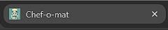

# Header

- Chef-O-Mat header consists of the site brand ambassador and the page links to the main page, the web app and the seasonal pages. 
- The nav bar transforms into a burger menu when the site is viewed at mobile size.
- This allows the user to navigate on a wide array of devices and screen sizes.

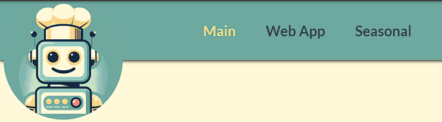

# Footer

- Footer is fixed at the bottom each page and is styled in the colour scheme of the site. 
- the footer contains two social media icons which 'expand' on hover on desktop and open the respective sites on click/tap.


# Main Page Welcome

- This is the initial landing page for users arriving at the site. 
- The welcome text is short and punchy introduction to what the site is for and the benefits of five ingredient cooking.

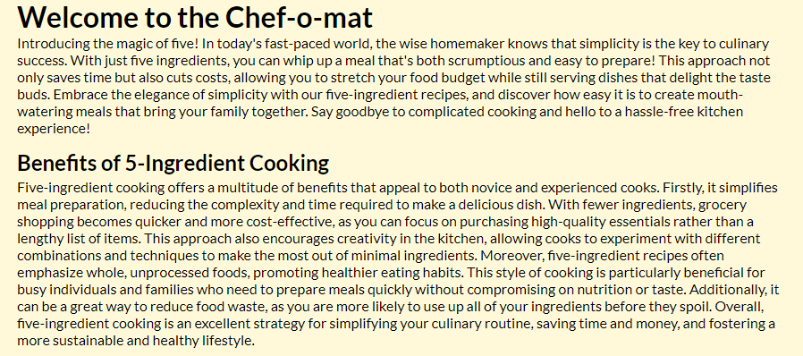

# Main Page Staples

- The staples section of the main page lists the staples a user should have on hand in order to be best prepared for 5 ingredient cooking
- The text is broken up with cartoony images of the staples, the images are dynamic to fix a wide array of screen widths and are hidden when viewed on smaller screens.

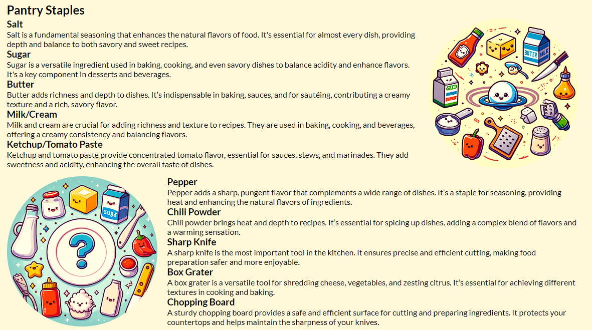


# Web App page

- This is the heart of the website that contains the actual functionality of the site.
- The form is labeled for the expected input and the 5 ingredient fields are required. 
- When the user submits the form, no data is passed, instead they are brought to a page called 'Not there'.

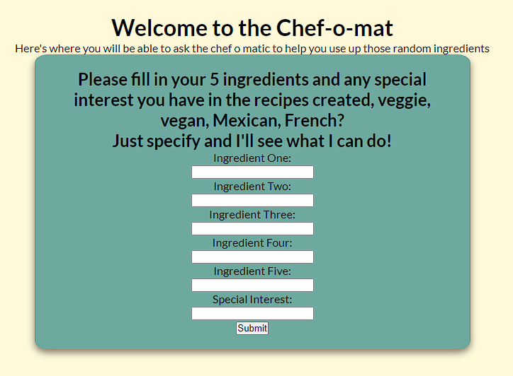

# Not There

- This page is displayed to the user in lieu of the Chat-GPT generated recipes. 
- The Chef-O-Mat hero image is replaced with a sad version to indicate sadness at not being able to carry out its duties. 
- The user is instead offered the chance to enter their email address to be notified when the Chef-O-Mat is ready to use. 
- Email address entry is validated on this form. 
- This page will be removed from the site once the web app is functional, as the user's email address will be captured at the account creation stage.

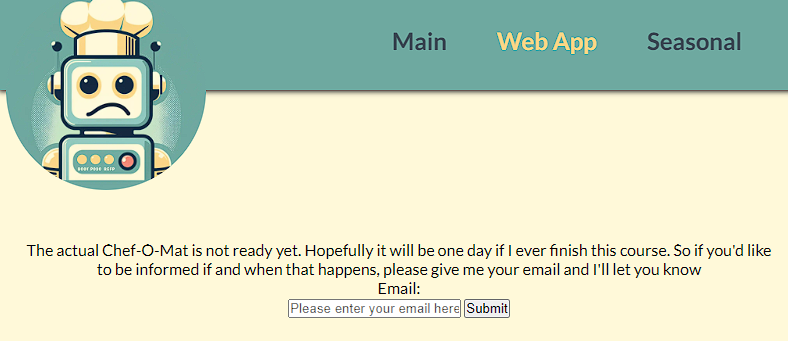


# Thanks

- Once the user has submitted an email address, they are brought to the 'thank_you' page. 
- Chef-O-Mat greets the user with a happy face giving the user positive feedback for submitting an email.
-  This page will be removed once the web app functionality is included; The happy asset reused at the end of the account creation process.

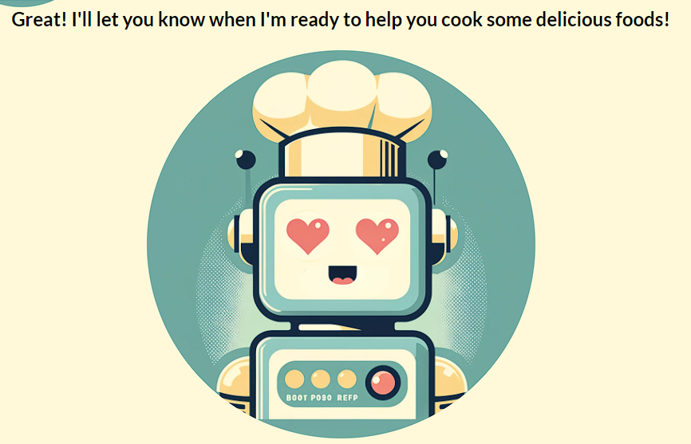


# Seasonal

- The Seasonal page contains some sample recipes showcasing the index card style the generated recipes will follow.
- Each recipe is displayed in a card format with a title, image, ingredients and instructions.
- The cards are responsive and the images dynamic allowing for maximum readability at all screen sizes.

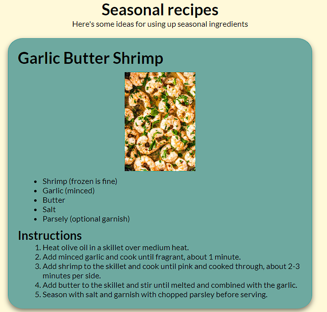

# 404 page

- I included a 404 page so that the user has a way to get back to the main content if they happen to get lost. 

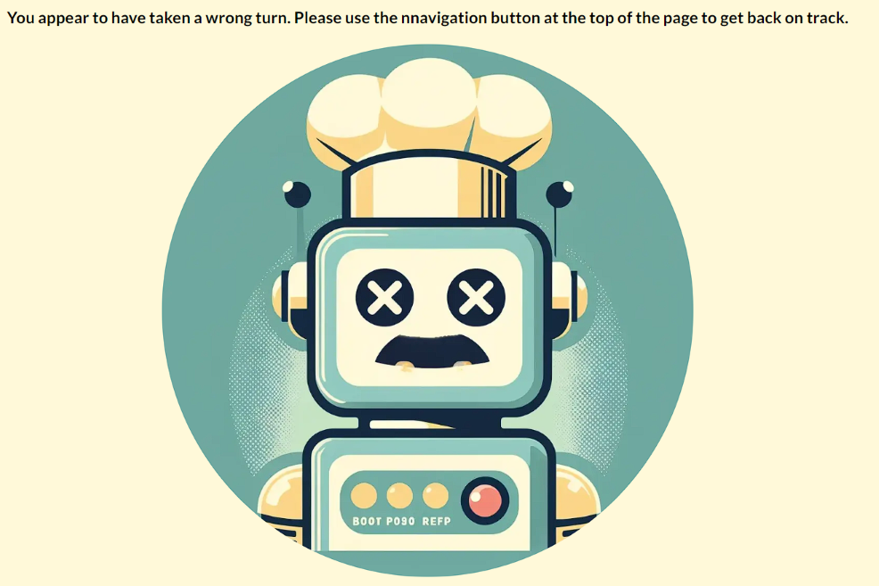


## Testing

### General Testing
Testing for the project was initially conducted on an ad hoc basis, closely following a rapid prototyping methodology. This approach involved creating, testing, and fixing features in quick succession, which facilitated rapid identification and resolution of issues during development. Once the project reached feature completeness, a more structured testing process was adopted to ensure comprehensive validation of the site's functionality and performance.

Below is an extract from the test script used to validate the project:


|          | Test Title                               | Test Steps                                                                                                                                                                                                                                                                                                                                                                                                                                                                                          | Validation                                                                                                                                                                                                                                                          | Results |
| -------- | ---------------------------------------- | --------------------------------------------------------------------------------------------------------------------------------------------------------------------------------------------------------------------------------------------------------------------------------------------------------------------------------------------------------------------------------------------------------------------------------------------------------------------------------------------------- | ------------------------------------------------------------------------------------------------------------------------------------------------------------------------------------------------------------------------------------------------------------------- | ------- |
| UX       | Active Nav link - nav menu               | Full nav mode:<br>1. From the MAIN page click on each nav link in turn<br>Verify A)                                                                                                                                                                                                                                                                                                                                                                                                            | A) Verify active page is indicated by yellow text.                                                                                                                                                                                                                  | pass    |
|          | Active Nav link - burger menu            | Burger menu mode:<br>1. Open burger menu from MAIN page<br>Verify A)<br>2. Tap on Web App link<br>3. Once on Web App page, open burger menu<br>Verify B)<br>4. Tap on Seasonal<br>5. Once on Seasonal page, open burger menu<br>Verify C)                                                                                                                                                                                                                                                   | A) Verify Main is active<br>B) Verify Web app link is active and displayed in yellow.<br>C) Verify Seasonal link is active and displayed in yellow.                                                                                                                 | pass    |
|          | Non nav linked pages keep web app active | 1. Open the Web App page<br>2. Tap on the submit button<br>Verify A)<br>3. Open responsive menu and change to a screen size that triggers the burger menu.<br>4. Open the burger menu<br>Verify B)<br>5. Return to nav link size for the page.<br>6. Enter a viable email address and tap submit<br>Verify C)<br>7. Again trigger the burger menu on the page and open it<br>Verify D)                                                                                                       | A) Verify that the not there page opens and that the web app link remains active.<br>B) The web app page is active<br>C) Verify the thank you page is loaded and that the active page remains the web app page.<br>D) The burger menu still has the web app active. | pass    |
|          | Burger menu                              | 1. Open the main page on a desktop browser<br>2. Open dev tools and trigger responsive mode<br>3. Shrink the width of the screen until the burger menu is triggered<br>Verify A)                                                                                                                                                                                                                                                                                                                 | A) The nav links text does not overlap the hero image before the burger menu mode is triggered.                                                                                                                                                                | pass    |
|          | Social media links                       | 1. Open the main page on desktop<br>2. Scroll to the footer and tap each social media icon<br>Verify A)<br>2. Open dev tools and trigger responsive mode<br>3. Set the screen width to be 250px wide<br>4. Tap on each social media icon<br>Verify A)<br>5. Set the screen width to be 340px and tap on each icon<br>Verify A)<br>6. Set the width to be 500px and tap each social media icon<br>Verify A)<br>7. Set the width for max resolution, tap on each social media icon<br>Verify A) | A) The correct site for each social media icon opens.                                                                                                                                                                                                            | pass    |
| Favicons | Tabs desktop                             | 1. Open the main page in a desktop browser<br>Verify A)<br>2. Open each page of the site in turn<br>Verify B)                                                                                                                                                                                                                                                                                                                                                                                       | A) The tab has the correct favicon displayed.<br>B) Each page displays the correct favicon.                                                                                                                                                                           | pass    |
|          | Bookmark desktop                         | 1. Open the main page in a desktop browser<br>2. Add a bookmark for the site<br>3. Open the browser's bookmarks<br>Verify A)                                                                                                                                                                                                                                                                                                                                                                       | A) The favicon is displayed correctly in the bookmarks.                                                                                                                                                                                                          | pass    |
|          | Tabs mobile                              | 1. Open the main page in a mobile browser<br>Verify A)<br>2. Open each page of the site in turn<br>Verify B)                                                                                                                                                                                                                                                                                                                                                                                      | A) The tab has the correct favicon displayed.<br>B) Each page displays the correct favicon.                                                                                                                                                                           | pass    |
|          | Bookmark mobile                          | 1. Open the main page in a mobile browser<br>2. Add a bookmark for the site<br>3. Open the browser's bookmarks<br>Verify A)                                                                                                                                                                                                                                                                                                                                                                      | A) The favicon is displayed correctly in the bookmarks.                                                                                                                                                                                                          | pass    |
|          | Add to home - mobile                     | 1. Open the page in a mobile browser<br>2. Choose to add the site to the home page<br>Verify A)                                                                                                                                                                                                                                                                                                                                                                                                       | A) The site is represented by the correct favicon on the test device's home screen.                                                                                                                                                                              | pass    |


In addition coverage testing was performed on a selection of mobile devices:

|             | Main page | Web App | Not there | Thank you | Seasonal | Favicons |
| ----------- | --------- | ------- | --------- | --------- | -------- | -------- |
| Pixel 8     | Pass      | Pass    | Pass      | Pass      | Pass     | Pass     |
| Pixel 4     | Pass      | Pass    | Pass      | Pass      | Pass     | Pass     |
| Nokia t20   | Pass      | Pass    | Pass      | Pass      | Pass     | Pass     |
| Iphone 8+   | Pass      | Pass    | Pass      | Pass      | Pass     | Pass     |
| Ipad Pro 13 | Pass      | Pass    | Pass      | Pass      | Pass     | Pass     |

Desktop browser coverage was also completed as follows:

|            | Chrome | Safari | Firefox | Edge | Opera | Arc  | Resolution range |
| ---------- | ------ | ------ | ------- | ---- | ----- | ---- | ---------------- |
| Windows 11 | Pass   | Pass   | Pass    | Pass | Pass  | Pass | 250px - 3440px   |
| Mac OS     | Pass   | Pass   | Pass    | Pass | Pass  | Pass | 250px - 2560px   |

### Accessibility Testing:

Accessibility was considered from the very beginning of the project, and best practices for accessibility were followed. To validate the accessibility of the site, I ran the webpages through the Lighthouse and WAVE testing tools.


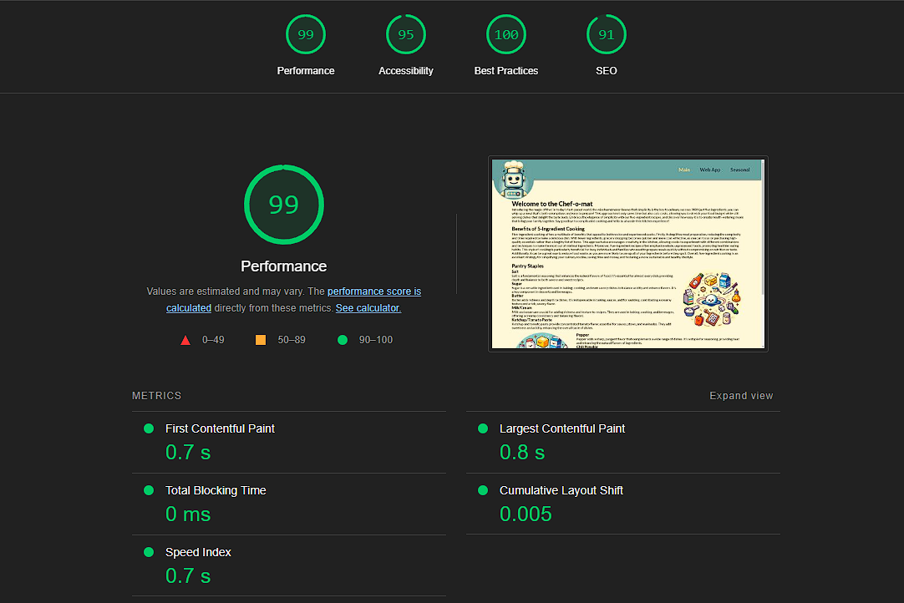

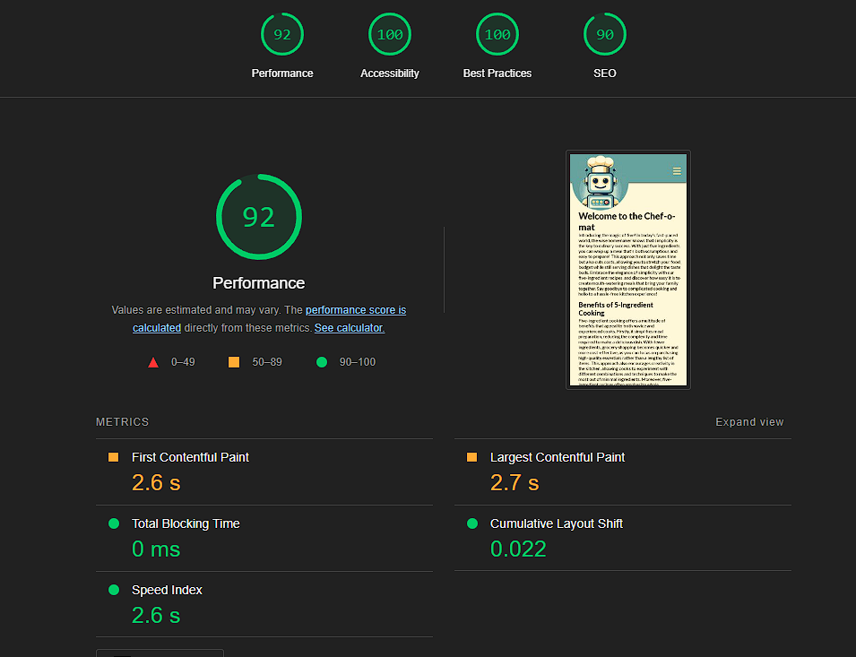

[Link to Full report](https://googlechrome.github.io/lighthouse/viewer/?psiurl=https%3A%2F%2Fdutes.github.io%2Fci_portfolio_one%2Findex.html&strategy=desktop&category=performance&category=accessibility&category=best-practices&category=seo&locale=en-US&utm_source=lh-chrome-ext)


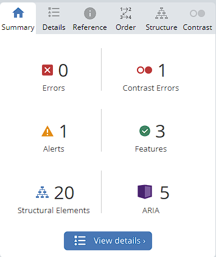

[Link to Full report](https://wave.webaim.org/report#/https://dutes.github.io/ci_portfolio_one/index.html)


### Validation Testing
I ran my site through the W3C HTML and CSS validators and no errors were found. 
Results available here:

[HTML](https://validator.w3.org/nu/?doc=https%3A%2F%2Fdutes.github.io%2Fci_portfolio_one%2Findex.html)

[CSS](https://jigsaw.w3.org/css-validator/validator?uri=https%3A%2F%2Fdutes.github.io%2Fci_portfolio_one%2Findex.html&profile=css3svg&usermedium=all&warning=1&vextwarning=&lang=en)

### Unfixed Issues
The Lighthouse test gave the site a 95% accessibility score. While this is a strong indication of the site's accessibility, Lighthouse alone is not considered a comprehensive measure. The WAVE test identified one contrast error on the active navigation page color. I attempted to address this issue, but due to the constraints of using only HTML and CSS, I was unable to implement a satisfactory solution. In a future project, I plan to enhance the navigation experience by adding an animated color-contrasting background for the active page. This will help provide better accessible contrast and improve the overall user experience.

### Deployment

## Development and source control

The site was created using Visual Studio and source code controlled in a GitHub repository.
When I wanted to commit new code to the project I used the following commands:

```git add <filename>``` 
-this added the chosen file to the staging area.

```git commit -m "commit message"``` -this command committed the files in staging to the local repository with a short piece on what changes I had made that I wanted to add to the project.

```git push``` -this command pushed (or synced) the committed changes to the remote repository on my GitHub account.

## Deployment Process

The site is deployed to GitHub Pages.
The process is as follows:
 - Open the github repository, navigate to settings tab.
 - From the left hand side menu, open the 'Pages' link.
 - Select Main from the source drop-down.
 - The deployment process will begin and progress can be observed with the ribbon display on the right hand side of the Github page. Once the displays green the site should be deployed.

 The live link to the site is: [Chef-O-Mat](https://dutes.github.io/ci_portfolio_one/index.html)

 ## Cloning

 To work on the project locally you follow these steps:
 - Click on the code dropdown menu button
 - Click on HTTPS
 - Copy the link to the repository
 - Ensure your local IDE has github installed (for example as an extension in VStudio)
 - Open the IDE's terminal and type:

```git clone <paste link copied from repo>```

 - hit enter and the project will be cloned locally for you to work on.


 ### References
 
 ***W3C Schools***

 [W3C](https://www.w3schools.com/) - Used extensively for HTML and CSS learnings.

***CSS-Tricks***

[CSStricks](https://css-tricks.com)- Used for CSS understanding. 


***CSS Flexbox Froggy***

[CSS-Froggy](https://flexboxfroggy.com/)- for CSS display flex understanding

***Dall-E***

[Dall-E](https://openai.com/index/dall-e-3/)- Used for image generation of Chef-O-Mat and associated images.

### Technologies Used
- HTML
  - Site developed in HTML.
- CSS 
  - Site stylised with linked CSS file.
- GitHub 
  - Source control and storage.
- GitHub Pages
  - Deployment of site.
- Git 
  - Used to commit code to source control.
- Tinyjpg
  - [Tinyjpg](https://tinyjpg.com/) used to compress image assets of the web site.
- Font Awesome
  - [FontAwesome](https://fontawesome.com/) used for the social media icons.
- Favicon
  - [Favicon](https://favicon.io/favicon-converter/) used to generate the favicons for the site.
- Google Fonts
  - [Google Fonts](https://fonts.google.com/) Used for the fonts on the site.
- Excel to Markdown
  - [Excel to Markdown](https://tabletomarkdown.com/convert-spreadsheet-to-markdown/)- Used for tables in testing section
  
## Credits and Thanks

Credit for the images on the seasonal recipes page:

[Garlic Butter Shrimp](https://encrypted-tbn0.gstatic.com/images?q=tbn:ANd9GcThZa8vG5fwMOOFhih7WsGICvPX7iY7wlwIx6BvK3PiDRlpoM4M)

[Balsamic Glazed Chicken](https://encrypted-tbn0.gstatic.com/images?q=tbn:ANd9GcTWQoz_a9HZkLTF0k7TRB4ycaoZvQ8JTU-f2afZ2ddLisYmxgFZ)

[Honey Baked Pears](https://encrypted-tbn2.gstatic.com/images?q=tbn:ANd9GcR_ifQn_GnOzInYUVMLDLDXrsbkUXZY4Qc5vEJ_EzqkCtaSENA2)

Thanks to my mentor on the project, Daisy Mc Girr for all the help and advice.
