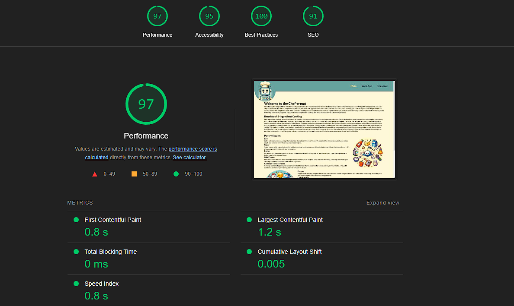

## Chef-O-Mat

Ever found yourself staring at a random assortment of ingredients and a few pantry staples, wondering, "What can I make with these?" Then this website is here to answer that question for you. 
Whether you are a practiced home cook or someone who couldn't boil an egg - this site has your back. Simply input five of your ingredients and any particular cuisine style, and the Chef-O-Mat will give you some simple, delicious, and creative meal recipes.
Turn the last meal time before the week's grocery shop into a fun culinary playground!

## Wire Frame

Here is the wirefame which formed the foundation of the website's design. It specifies the desired layout and helped to guide understanding of the CSS styling.

## Features (Delivered as part of Project 1)
**LO1: Design an interactive Front-End web application using HTML and CSS based on the principles of user experience design, accessibility and responsivity.**

I designed and built a multi-page, responsive and mobile first website using HTML and CSS. The design is derived from research as well as my own preferences for the UX of a site. Accessibility was considered from the begining of the project and largely meets ARIA requirements. The site is also fully responsive adapting on the fly to resolutions from 250px to at least 3440px ensuring a consistent user experience.

**LO2: Test a front-end web application through the development, implementation and deployment stages.**

Throughout the development process, I have maintained a rigourous design, build, test, itterate cycle ensuring both smooth functionality as well as a pleasing, consistent user experience across a wide array of browsers, operating systems and device types. 

**LO3: Deploy a Front-End web application to a Cloud platform.**

The Chef-O-Mat site has successfully been deployed to the web via GitHub Pages. The deployment not only assures the site is reachable on the general web, but it was also key to being able to test the design and eliminate bugs. The deployed site was continously updated from the commits on the main project's GitHub repository.

**LO04: Maximise future maintainability through documentation, code structure and organisation.**

Maintainability was built in from the intial project stages with clear naming conventions, modularised CSS and code practices. The Readme document provides detail on the project from setup and installation to current status, testing performed and future development goals.

**LO5: Demonstrate and document the development process through a version control system such as GitHub.**

The entire development of the project has been managed using GitHub as its version control and development environment. Changes have been commited regularly with clear commit messaging allowing a full over view of the progress and milestones of the project's process from concept to submission. 

## Features (envisioned)

The envisioned features of this project aim to transform the basic, static site  into a dynamic and interactive web application. The primary functionality will be an ingredient input form where users can enter up to five ingredients and select a preferred cuisine style. These inputs will be sent via an API to Chat-GPT, which will generate five recipes based on the user's input. The generated recipes will be returned and displayed in a uniformly styled card format that includes the recipe name, an image, the ingredients list, and preparation instructions. Additional future functionality will enable users to create accounts, save their preferred recipes, and share them on social media. These enhancements will significantly improve user engagement and provide a richer, more immersive user experience.

## Site Map
Here is a visual site map of the Chef-O-Mat site:

**Main Page**

This is the initial landing page for users arriving at the site. The page is designed to give the user a welcoming sensation with a prominent Chef-O-Mat hero image and a simple layout. The text is short and punchy, drawing the user's eyes to it. The navigation element in the header catches the eye and entices the user to click the text links.

**Web App page**

This is the second page in the navigation element. It is the heart of the website as it will contain the key functionality for the site. The form is written in standard HTML and is currently not validating input since the underlying functionality is not yet present. Clicking submit on this form, even while empty, will bring the user to a non-navigation linked page called 'Not There'.

**Email**

This page is displayed to the user in lieu of the Chat-GPT generated recipes. The Chef-O-Mat hero image is replaced with a sad version to indicate sadness at not being able to carry out its duties. The user is instead offered the chance to enter their email address to be notified when the Chef-O-Mat is ready to use. Email address entry is validated on this form. This page will be removed from the site once the web app is functional, as the user's email address will be captured at the account creation stage.

**Thanks**

On the Thanks page, Chef-O-Mat indicates its pleasure that the user has entered an email address. This is a positive feedback instance for the user, as the cute robot shows genuine happiness at being entrusted with the user's address. This page will also be removed once the web app functionality is included, with the happy asset reused at the end of a successful account creation process.

**Seasonal**

The Seasonal page currently contains some sample recipes showcasing the index card style the generated recipes will follow. This page will evolve into a page displaying the most shared recipes generated in the past period of time. There is potential for sponsored content to be included in the sample recipes listed here in the future.

## Testing

Testing for the project was initially conducted on an ad hoc basis, closely following a rapid prototyping methodology. This approach involved creating, testing, and fixing features in quick succession, which facilitated rapid identification and resolution of issues during development. Once the project reached feature completeness, a more structured testing process was adopted to ensure comprehensive validation of the site's functionality and performance.

Below is an extract from the test script used to validate the project:

|          | Test Title                               | Test Steps                                                                                                                                                                                                                                                                                                                                                                                                                                                                                          | Validation                                                                                                                                                                                                                                                          | Results |
| -------- | ---------------------------------------- | --------------------------------------------------------------------------------------------------------------------------------------------------------------------------------------------------------------------------------------------------------------------------------------------------------------------------------------------------------------------------------------------------------------------------------------------------------------------------------------------------- | ------------------------------------------------------------------------------------------------------------------------------------------------------------------------------------------------------------------------------------------------------------------- | ------- |
| UX       | Active Nav link - nav menu               | Full nav mode: 1. From the MAIN page click on each nav link in turn Verify A)                                                                                                                                                                                                                                                                                                                                                                                                            | A) Verify active page is indicated by yellow text.                                                                                                                                                                                                                  | pass    |
|          | Active Nav link - burger menu            | Burger menu mode: 1. Open burger menu from MAIN page Verify A) 2. Tap on Web App link 3. Once on Web App page, open burger menu Verify B) 4. Tap on Seasonal 5. Once on Seasonal page, open burger menu Verify C)                                                                                                                                                                                                                                                   | A) Verify Main is active B) Verify Web app link is active and displayed in yellow. C) Verify Seasonal link is active and displayed in yellow.                                                                                                                 | pass    |
|          | Non nav linked pages keep web app active | 1. Open the Web App page 2. Tap on the submit button Verify A) 3. Open responsive menu and change to a screen size that triggers the burger menu. 4. Open the burger menu Verify B) 5. Return to nav link size for the page. 6. Enter a viable email address and tap submit Verify C) 7. Again trigger the burger menu on the page and open it Verify D)                                                                                                       | A) Verify that the not there page opens and that the web app link remains active. B) The web app page is active C) Verify the thank you page is loaded and that the active page remains the web app page. D) The burger menu still has the web app active. | pass    |
|          | Burger menu                              | 1. Open the main page on a desktop browser 2. Open dev tools and trigger responsive mode 3. Shrink the width of the screen until the burger menu is triggered Verify A)                                                                                                                                                                                                                                                                                                                 | A) The nav links text does not overlap the hero image before the burger menu mode is triggered.                                                                                                                                                                | pass    |
|          | Social media links                       | 1. Open the main page on desktop 2. Scroll to the footer and tap each social media icon Verify A) 2. Open dev tools and trigger responsive mode 3. Set the screen width to be 250px wide 4. Tap on each social media icon Verify A) 5. Set the screen width to be 340px and tap on each icon Verify A) 6. Set the width to be 500px and tap each social media icon Verify A) 7. Set the width for max resolution, tap on each social media icon Verify A) | A) The correct site for each social media icon opens.                                                                                                                                                                                                            | pass    |
| Favicons | Tabs desktop                             | 1. Open the main page in a desktop browser Verify A) 2. Open each page of the site in turn Verify B)                                                                                                                                                                                                                                                                                                                                                                                       | A) The tab has the correct favicon displayed. B) Each page displays the correct favicon.                                                                                                                                                                           | pass    |
|          | Bookmark desktop                         | 1. Open the main page in a desktop browser 2. Add a bookmark for the site 3. Open the browser's bookmarks Verify A)                                                                                                                                                                                                                                                                                                                                                                       | A) The favicon is displayed correctly in the bookmarks.                                                                                                                                                                                                          | pass    |
|          | Tabs mobile                              | 1. Open the main page in a mobile browser Verify A) 2. Open each page of the site in turn Verify B)                                                                                                                                                                                                                                                                                                                                                                                      | A) The tab has the correct favicon displayed. B) Each page displays the correct favicon.                                                                                                                                                                           | pass    |
|          | Bookmark mobile                          | 1. Open the main page in a mobile browser 2. Add a bookmark for the site 3. Open the browser's bookmarks Verify A)                                                                                                                                                                                                                                                                                                                                                                      | A) The favicon is displayed correctly in the bookmarks.                                                                                                                                                                                                          | pass    |
|          | Add to home - mobile                     | 1. Open the page in a mobile browser 2. Choose to add the site to the home page Verify A)                                                                                                                                                                                                                                                                                                                                                                                                       | A) The site is represented by the correct favicon on the test device's home screen.                                                                                                                                                                              | pass    |

In addition coverage testing was performed on a selection of mobile devices:

|             | Main page | Web App | Not there | Thank you | Seasonal | Favicons |
| ----------- | --------- | ------- | --------- | --------- | -------- | -------- |
| Pixel 8     | Pass      | Pass    | Pass      | Pass      | Pass     | Pass     |
| Pixel 4     | Pass      | Pass    | Pass      | Pass      | Pass     | Pass     |
| Nokia t20   | Pass      | Pass    | Pass      | Pass      | Pass     | Pass     |
| Iphone 8+   | Pass      | Pass    | Pass      | Pass      | Pass     | Pass     |
| Ipad Pro 13 | Pass      | Pass    | Pass      | Pass      | Pass     | Pass     |

Desktop browser coverage was also completed as follows:

|            | Chrome | Safari | Firefox | Edge | Opera | Arc  | Resolution range |
| ---------- | ------ | ------ | ------- | ---- | ----- | ---- | ---------------- |
| Windows 11 | Pass   | Pass   | Pass    | Pass | Pass  | Pass | 250px - 3440px   |
| Mac OS     | Pass   | Pass   | Pass    | Pass | Pass  | Pass | 250px - 2560px   |

**Accessibility Testing:**

Accessibility was considered from the very beginning of the project, and best practices for accessibility were followed. To validate the accessibility of the site, I ran the webpages through the Lighthouse and WAVE testing tools.

The Lighthouse test gave the site a 95% accessibility score. While this is a strong indication of the site's accessibility, Lighthouse alone is not considered a comprehensive measure. The WAVE test identified one contrast error on the active navigation page color. I attempted to address this issue, but due to the constraints of using only HTML and CSS, I was unable to implement a satisfactory solution. In a future project, I plan to enhance the navigation experience by adding an animated color-contrasting background for the active page. This will help provide better accessible contrast and improve the overall user experience.